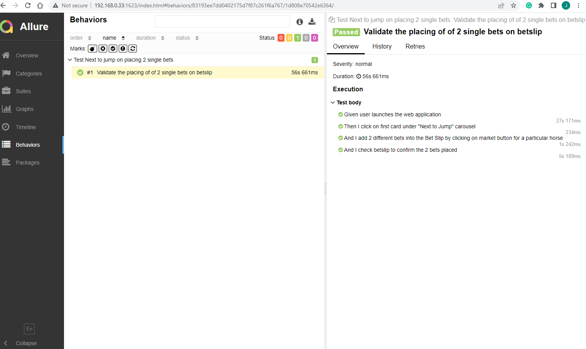

##  Setup

Install python

##  Setup venv (once)

1. py -m pip install --upgrade pip

     py -m pip --version
2. source venv/bin/activate
3. py -m pip install --user virtualenv
4. py -m venv env'''
5. .\env\Scripts\activate
6. py -m pip install requests

## Run the test
1. Click on the green arrow to the left of each Scenario or click
   on the green arrow across Feature to run all scenarios for that feature file

 A. betslip.feature is for Web UI tests

## Run the test with allure report
1. behave --no-capture --no-skipped $tags -f allure_behave.formatter:AllureFormatter -o test/allure-results features
2. generate the report - allure serve test/allure-results

Screenshots of report:
