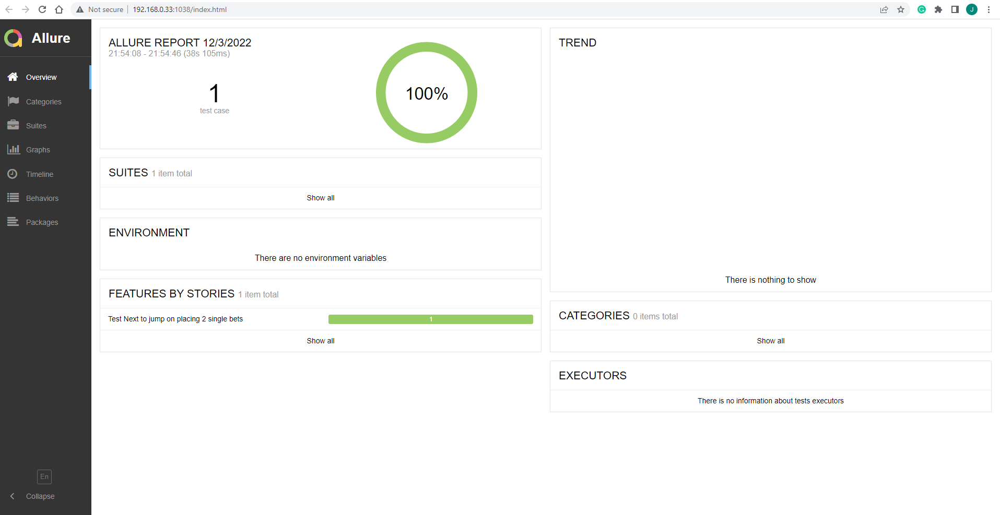

##  Setup

Install python

##  Setup venv (once)

1. py -m pip install --upgrade pip

     py -m pip --version
2. source venv/bin/activate
3. py -m pip install --user virtualenv
4. py -m venv env'''
5. .\env\Scripts\activate
6. py -m pip install requests

## Run the test
1. Click on the green arrow to the left of each Scenario or click
   on the green arrow across Feature to run all scenarios for that feature file

 A. betslip.feature is for Web UI tests

## Run the test with allure report
1. behave --no-capture --no-skipped $tags -f allure_behave.formatter:AllureFormatter -o test/allure-results features
2. generate the report - allure serve test/allure-results

## Assessment details
1. Any assumption made - 
   Python3 is installed and Pycharm IDE is installed
2. Problems encountered and how you might fix it given more time - 
   So far no problems occurred but I may optimise the locators to make the code less flaky. 
3. Problems you may encounter as the suite grows - 
   As the suite grows the tests become flaky. Need to break the pages into smaller components to resuse the components on different pages. I will add more suitable waits. I will add more assert statements. I will add the screenshot feature so that the report captures them on pass and fail.Also as the suite grows the number of tests grow so will add the parallel run feature.
4. Any improvement areas to make it easier for adoption by other team members / easier to implement future tests - 
   I will create base libraries or base framework suite which can be used throughout different teams. Hence, at organisational level different teams will be working on same base framework with different features. 

Screenshots of report:

